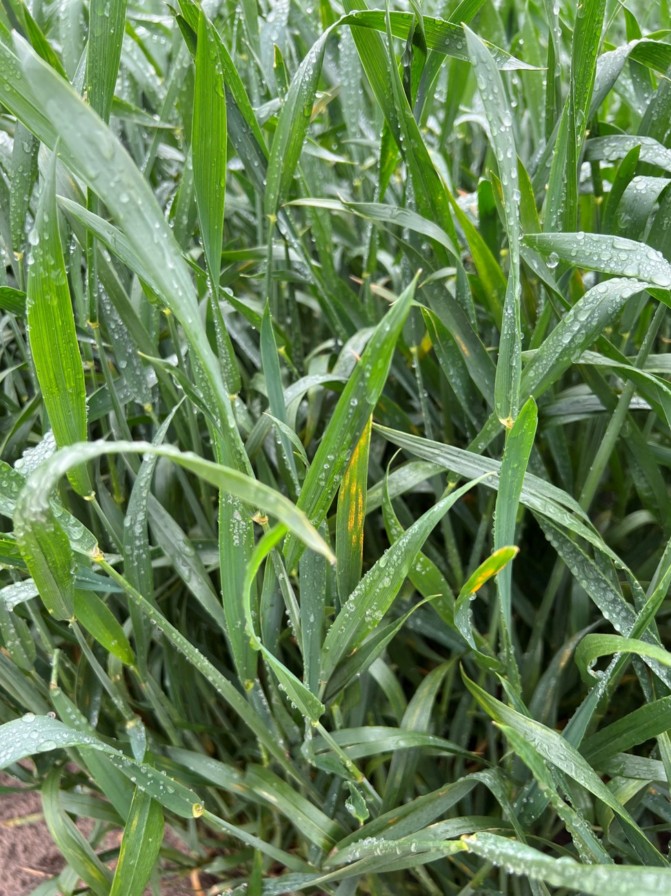
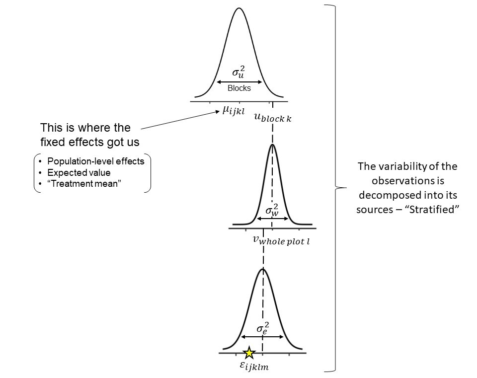

# Section 3: Generalized Linear Mixed Models - GLMMs

Learning objectives:

-   What are GLMMs?

-   What are the GLMMs components?

-   How to work with GLMMs?

## What are GLMMs

-   Generalized Linear Models are models in which we can assume different distributions for our data beyond the Normal distribution.

-   Similar to general linear models, GLMs can also have random effects, thus, Generalized Linear Mixed Models - GLMMs.

### The structure of a GLMM

Remember that for a **LMMs**, assuming $\mathbf{y}$ arises from a normal distribution, we have:

$$
\mathbf{y} ={X}\boldsymbol{\beta} + Zu + \boldsymbol{\varepsilon} \\ \mathbf{\begin{bmatrix} \mathbf{u} \\ \boldsymbol{\varepsilon} \end{bmatrix} \sim \begin{pmatrix}  \begin{bmatrix} 0 \\ 0 \end{bmatrix}, \begin{bmatrix} \mathbf{G} \; 0 \\ 0 \; \mathbf{R} \end{bmatrix} \end{pmatrix}}
$$

In which:

-   $\mathbf{X}\boldsymbol{\beta}$ represents our fixed part of the equation, where $\mathbf{X}$ is a matrix informing the levels of our treatments and $\boldsymbol{\beta}$ a vector containing the fixed-effects parameters.

-   $\mathbf{Zu}$ represents our random part, where $\mathbf{Z}$ is a matrix informing the levels of the random effects and $\mathbf{u}$ is the vector containing the random effects parameters.

-   $\boldsymbol{\varepsilon}$ is the vector containing the residuals.

-   From $\mathbf{Zu} + \boldsymbol{\varepsilon}$ we have: $\mathbf{G}$ is the variance-covariance matrix of the random effects, and $\mathbf{R}$ is the variance-covariance matrix of the residuals.

    -   $\mathbf{G} = \boldsymbol{\sigma^2_u}\mathbf{I}$ and $\mathbf{R} = \boldsymbol{\sigma^2}\mathbf{I}$, in which $\mathbf{I}$ is the identity matrix.

Which is similar to:

$$
\mathbf{u} \sim N(0, \mathbf{I}\sigma^2_u) \\
\boldsymbol{\varepsilon} \sim N(0, \mathbf{I}\sigma^2)
$$

In this case:

$$
E(\mathbf{y}) = \mathbf{X}\boldsymbol{\beta}, \\
Var(\mathbf{y}) = \mathbf{ZGZ' + R}
$$

We can also write this model as:

$$
\mathbf{y} \sim N(\mathbf{X}\boldsymbol{\beta}, \; \mathbf{ZGZ' + R})
$$

or:

$$
\mathbf{y} \sim N(\mathbf{X}\boldsymbol{\beta}, \; \boldsymbol{\Sigma}) \\
\boldsymbol{\Sigma} = \mathbf{ZGZ' + R}
$$

For **GLMMs** the structure changes based on the distribution we will assume for $\mathbf{y}$, but is very similar to the last notation presented. A generic definition would be:

$$
\mathbf{y|u} \sim P(\mu, \; \phi)
$$

In which:

-   Linear predictor: $g(\mu) = \eta = \mathbf{X}\boldsymbol{\beta} + Zu$

    -   $g(\mu) = \eta$ is the link function applied to the expected value.

    -   $E(\mathbf{y|u}) = \mu$.

### Components of GLMMs

#### Link Functions

Our linear predictor $\mathbf{X}\boldsymbol{\beta}$ can produce all possible values in the y-axis of a plot, from $- \; \infty$ to $+ \; \infty$ depending on the value of the predictor variable. A link function links the linear predictor and the distribution assumed for the data $\mathbf{y}$.

In the **link scale**, the mean of $\mathbf{y}$ respect linearity of the linear predictor. In the **response scale**, the mean $\mu$ is back transformed by the inverse link and respects the support of the distribution.

The link function is applied to the expected value ($E(\mathbf{y})$), and not to the observations. Transformation of the observations also effect the error, while link functions only affect the parameters controlling the expected value.

Example of link functions:

+-------------------+-----------------------------------+--------------------------------+---------------------------------------------------------------------------------------------------------+
| Link Function     | Equation                          | Use                            | Why                                                                                                     |
+:=================:+:=================================:+:==============================:+:=======================================================================================================:+
| **Identity Link** | $g(\mu) = \mu$                    | Normal dist.                   | $E(\mathbf{y})$ can take any real value ($-\infty, \; +\infty$)                                         |
+-------------------+-----------------------------------+--------------------------------+---------------------------------------------------------------------------------------------------------+
| **Logit Link**    | $g(\mu) = log(\frac{\mu}{1-\mu})$ | Logistic, Beta, Binomial dist. | $E(\mathbf{y})$ can take any values between 0 and 1. Maps $(0, \; 1) \rightarrow (-\infty, \; +\infty)$ |
+-------------------+-----------------------------------+--------------------------------+---------------------------------------------------------------------------------------------------------+
| **Log Link**      | $g(\mu) = log(\mu)$               | Poisson, Gamma dist.           | $E(\mathbf{y})$ can take any positive values ($\mu > 0$)                                                |
|                   |                                   |                                |                                                                                                         |
|                   |                                   |                                | Multiplicative effects                                                                                  |
+-------------------+-----------------------------------+--------------------------------+---------------------------------------------------------------------------------------------------------+

#### Distributional assumption for the data

GLMMs support different distributions from the exponential family. Distributions from the exponential family share common structure, but are relatively different among themselves.

-   **What is an assumption?**: Something you take as true about your data or about the process that generated it!

Important distributions to know are:

-   **For continuous data**: Normal, t, Gamma, Beta.

-   **For discrete data**: Binomial, Poisson, Negative Binomial.

#### **Normal distribution**

$$
y \sim N(\mu, \; \sigma^2)
$$

$$
E(y) = \mu \\
Var(y) = \sigma^2
$$

**Support:**

$$
y \in (-\infty, \; +\infty)
$$

**GLMM characteristics**

Type of variable: Continuous

Link: Identity - $\eta = \mu$

Mean: $\mu$

Var: $\sigma^2$

```{r, echo=FALSE, warning=FALSE, message=FALSE}
x <- seq(-10, 10, 0.1) 
plot(x, dnorm(x, 0, 1), type = "l", lwd = 2, ylab = "[x]", xlab = "x", ylim = c(0, 0.4)) 
lines(x, dnorm(x, 0, 4), lty = 2) 
lines(x, dnorm(x, 2, 1), lty = 3) 
legend("topright", legend = c("x ~ Normal(0,1)", "x ~ Normal(0,16)", "x ~ Normal(2, 1)"), lty = c(1,2,3), bty = "n")
```

#### **Student t distribution**

$$
y\sim t_v(\mu, \; \sigma^2)
$$

<center>

$E(y) = \mu$ for $v > 1$, otherwise undefined

$Var(y) = \frac{v}{v-2} \sigma^2$, otherwise undefined

</center>

**Support:**

$$
y \in (-\infty, \; +\infty)
$$

**GLMM characteristics**

Type of variable: Continuous

Link: Identity - $\eta = \mu$

Mean: $\mu$

Var: $\sigma^2$

```{r, echo=FALSE, warning=FALSE, message=FALSE}
x <- seq(-10, 10, 0.1) 
plot(x, dt(x, 2), type = "l", lwd = 2, ylab = "[x]", xlab = "x", ylim = c(0, 0.4)) 
lines(x, dt(x, 100), lty = 2) 
lines(x, dt(x, 2, 2), lty = 3) 
legend("topright", legend = c("x ~ t(2)", "x ~ t(100)", "x ~ t(2, 2)"), lty = c(1,2,3), bty = "n")
```

#### **Gamma distribution**

$$
y \sim Gamma(\alpha, \; \beta)
$$

$$
E(y) = \frac{\alpha}{\beta} \\
Var(y) = \frac{\alpha}{\beta^2}
$$

**Support:**

$$
y \in (0, \; +\infty)
$$

**GLMM characteristics**

Type of variable: Continuous

Link: Log or Inverse - $\eta = log(\mu)$ or $\eta = \frac{1}{\mu}$

Mean: $\mu$

Var: $\phi\mu^2$

```{r, echo=FALSE, warning=FALSE, message=FALSE}
x <- seq(0, 12.5, 0.1) 
plot(x, dgamma(x, 2, 2), type = "l", lwd = 2, ylab = "[x]", xlab = "x", ylim = c(0, 1.5)) 
lines(x, dgamma(x, 10, 2), lty = 2) 
lines(x, dgamma(x, 3, 5), lty = 3) 
legend("topright", legend = c("x ~ Gamma(2, 2)", "x ~ Gamma(10, 2)", "x ~ Gamma(3, 5)"), lty = c(1,2,3), bty = "n")
```

#### **Beta distribution**

$$
y \sim Beta(\alpha, \; \beta)
$$

$$
E(y) = \frac{\alpha}{\alpha + \beta} \\
Var(y) = \frac{\alpha\beta}{(\alpha+\beta)^2(\alpha+\beta+1)}
$$

**Support**:

$$
y \in (0, \; 1)
$$

**GLMM characteristics**

Type of variable: Proportion

Link: Logit - $\eta = logit(\mu) = log(\frac{\mu}{1-\mu})$

Mean: $\mu$

Var: $\frac{\mu(1-\mu)}{1+\phi}$

```{r, echo=FALSE, warning=FALSE, message=FALSE}
x <- seq(0.01, 0.99, 0.01) 
plot(x, dbeta(x, 0.5, 0.5), type = "l", lwd = 2, ylab = "[x]", xlab = "x", ylim = c(0, 3)) 
lines(x, dbeta(x, 1, 1), lty = 2) 
lines(x, dbeta(x, 4, 2), lty = 3) 
legend("top", legend = c("x ~ Beta(0.5, 0.5)", "x ~ Beta(1, 1)", "x ~ Beta(4, 2)"), lty = c(1,2,3), bty = "n")
```

#### **Poisson distribution**

$$
y \sim Poisson(\lambda)
$$

$$
E(y) = \lambda \\
Var(y) = \lambda
$$

**Support:**

$$
y \in (0, 1, 2, ..., +\infty)
$$

-   Model the number of events occurring in a fixed interval of time/space given a rate of occurrence ($\lambda$).

**GLMM characteristics**

Type of variable: Discrete count

Link: Log - $\eta = log(\lambda)$

Mean: $\lambda$

Var: $\lambda$

```{r, echo=FALSE, warning=FALSE, message=FALSE}
x <- seq(0, 17, 1)
off.set <- 0.2
plot(x, dpois(x, 2), type = "h", lwd = 6, ylab = "[x]", xlab = "x", ylim = c(0, 0.3), col = adjustcolor("#C3C3C3", alpha.f = 1)) 
lines(x + off.set, dpois(x, 6), type = "h", lwd = 6, col = adjustcolor("#757575", alpha.f = 1)) 
lines(x + 2*off.set, dpois(x, 10), type = "h", lwd = 6, col = adjustcolor("#1E1E1E", alpha.f = 1))  
legend("topright", legend = c("x ~ Pois(2)", "x ~ Pois(6)", "x ~ Pois(10)"), lty = c(1, 1, 1), lwd = 6, col = c("#C3C3C3", "#757575", "#1E1E1E"), bty = "n")
```

#### **Binomial distribution**

$$
y \sim Binomial(n, p)
$$

$$
E(y) = np \\
Var(y) = np(1-p)
$$

**Support**:

$$
y \in (0, 1, ..., n) \\
n \in (1, 2, ..., +\infty) \\
p \in (0, 1)
$$

-   Model the number of successes in a fixed number of independent trials ($n$) with a given probability of success ($p$).

**GLMM characteristics**

Type of variable: Discrete proportion

Link: Logit or probit - $\eta = log(\frac{\pi}{1-\pi})$ or $\eta = \Phi^{-1}(\pi)$

Mean: $\pi = \frac{\mu}{N}$

Var: $N\pi(1-\pi)$

```{r, echo=FALSE, warning=FALSE, message=FALSE}
x <- seq(0, 11, 1)
off.set <- 0.2
plot(x, dbinom(x, 10, 0.2), type = "h", lwd = 6, ylab = "[x]", xlab = "x", ylim = c(0, 0.5), col = adjustcolor("#C3C3C3", alpha.f = 1)) 
lines(x + off.set, dbinom(x, 10, 0.5), type = "h", lwd = 6, col = adjustcolor("#757575", alpha.f = 1)) 
lines(x + 2*off.set,  dbinom(x, 10, 0.8), type = "h", lwd = 6, col = adjustcolor("#1E1E1E", alpha.f = 1))  
legend("topright", legend = c("x ~ Binom(10, 0.2)", "x ~ Binom(10, 0.5)", "x ~ Binom(10, 0.8)"), lty = c(1, 1, 1), lwd = 6, col = c("#C3C3C3", "#757575", "#1E1E1E"), bty = "n")
```

## Checkpoint:

Learning objectives:

-   What are GLMMs?

-   What are the GLMMs components?

-   How to work with GLMMs?

## Working with GLMMs

1.  Define a distribution that matches $y$.
2.  Define the linear predictor (fixed and random effects) $\eta$.
3.  Define the link function that connects $E(y)$ of the assume distribution and the linear predictor $\eta$.

## Packages and what are we using them for

```{r, message=FALSE, warning=FALSE}
library(agridat) # Agricultural datasets
library(glmmTMB) # Package to fit GLMMs
library(car) # Anova for mixed models
library(emmeans) # Extract marginal means
library(multcomp) # Mean multiple comparisons
library(DHARMa) # Model check
```

```{r, echo=FALSE, warning=FALSE, message=FALSE}
library(readxl)
library(tidyverse)
library(ggplot2)

# Severity data - Example 1
d1 <- read_excel("C:/Users/cdiasda/OneDrive - Kansas State University/Desktop/Doutorado/Laboratory and research/Workshops/Mixed Models Workshop/USA041.xlsx")
colnames(d1) <- c("fungicide", "block", "severity_o")
d1 <- transform(d1, fungicide = as.factor(fungicide), block = as.factor(block))
d1$severity <- d1$severity_o/100

# Germination data - Example 2
d2 <- crowder.seeds
d2$gen <- as.factor(d2$gen)
d2$extract <- as.factor(d2$extract)
```

## Example I - Disease Severity

In this example we will evaluate disease severity. The data arises from a randomized complete block design experiment (RCBD) to test fungicide efficacy against yellow rust on wheat. The main response variable is disease severity. Severity refers to how much an specific organ is affected by a given disease. In this case it refers to the leaf area covered by yellow rust lesions, also know as pustules.

<center>{width="14cm"}</center>

**Data**

```{r, warning=FALSE, message=FALSE}
head(d1)
```

1.  Define a distribution that matches $y$.

$$ y \sim Beta(\mu, \; \phi) $$

-   Why?

    -   Severity is a percentage: 0 - 100%, in proportion: 0 - 1.

    -   The support from the Beta distribution perfectly matches our response variable.

    -   Recall the support for the Beta distribution:

$$
y \in (0, \; 1)
$$

2.  Define a linear predictor $\eta$.

$$ \eta_{ij} = \mu_0 + t_i + u_j $$

-   Where:

    -   $\mu_0$ represents the overall/gran mean.
    -   $t_i$ is the parameter for the effect of treatment, in this case, fungicides - **Fixed effect.**
    -   $u_j$ is the parameter for the effect of block - **Random effect.**

3.  Define the link function that connects $E(y)$ of the assume distribution and the linear predictor $\eta$.

<center>**Logit link**</center>

$$ g(\mu) = \eta = logit(\mu)$$

-   Why?

    -   Logit links $(-\infty, \; +\infty)$ to $(0, \; 1)$, that is our desired scale.

**Model**

$$
y_{ij}|u_j \sim Beta(\mu_{ij}, \; \phi) \\ logit(\mu_{ij}) = \eta_{ij} = \mu_0 + t_i + u_j \\ u_j \sim N(0, \sigma^2_u)
$$

**Fitting the model**

```{r, warning=FALSE, message=FALSE}
m1 <- glmmTMB(severity ~ fungicide + (1|block), family = beta_family(link = "logit"), data = d1)
summary(m1)
```

**Checking the model - Residuals**

```{r, warning=FALSE, message=FALSE, fig.width=20, fig.height=8}
res_sim1 <- simulateResiduals(m1, plot = TRUE)
```

**What are we checking here?**

Residuals: "The footprint of the fitted model" - How much model predictions deviate from observations.

$$ \epsilon_i = y_i - \hat{y}_i $$

For general linear mixed models our residuals are assumed to be normally distributed and with constant variance ($\varepsilon \sim i.i.d. N(0, \; \sigma^2_\varepsilon)$). In models with different distributional assumptions, residuals do not follow a known distribution, which makes it tricky to check models in a similar way we did before.

**What is each test doing?**

-   QQ-Plot

    -   Compare the quantiles[^1] of two distributions, if they are similar, we expect them to fall on a one to one diagonal line. In this case, in the y-axis we have the quantiles of the simulated residuals and in the x-axis the quantiles of a standard uniform distribution.

    -   Kolmogorov-Smirnov test: Test for uniformity against a uniform distribution - $Uniform(0, \; 1)$.

    -   Dispersion test: Variance in the observations vs. Variance on the simulations.

    -   Outlier test: Residual values of 0 or 1. Test if the number of outliers is appropriate to the size of the data. Does not quantify the amount of outliers.

-   Residual vs Predicted

    -   Show whether we have homocedasticity of the variances (constant variance across predicted values) or not. Usually, if higher or lower predicted values have higher or lower variance, the plot will present a "funnel" shape. Ideally the plot is a random scatter of points.

    -   Fit smoothed splines in three points of the quantile residuals, 0.25, 0.50, and 0.75. Test whether these lines are flat or have trends. For a random scatter, we do not expect to see trends at any of these points, this would indicate heterocedasticity.

    -   It also indicated when outliers are detected by producing a red asterisk.

[^1]: Quantiles divide a dataset into equal-sized subsets, helping to understand more about the distribution of the data.

**ANOVA**

```{r, warning=FALSE, message=FALSE}
Anova(m1)
```

**Post-hoc test - Mean comparisons**

```{r, warning=FALSE, message=FALSE}
emmeans(m1, ~fungicide, type = "response")
```

### What if we use a less appropriate assumption for severity?

Let's check Gamma!

```{r, warning=FALSE, message=FALSE, fig.width=20, fig.height=8}
m1_2 <- glmmTMB(severity_o ~ fungicide + (1|block), family = Gamma(link = "log"), data = d1)
res_sim1_2 <- simulateResiduals(m1_2, plot = TRUE)
```

```{r, echo=FALSE, warning=FALSE, message=FALSE, fig.width=20, fig.height=8}
means1 <- emmeans(m1, ~fungicide, type = "response")
means2 <- emmeans(m1_2, ~fungicide, type = "response")
g1 <- cld(means1, Letters = letters)
g2 <- cld(means2, Letters = letters)

gd1 <- data.frame(g1)
gd2 <- data.frame(g2)

comp <- rbind(gd1, gd2)
comp$id <- ifelse(comp$response > 1, "Gamma", "Beta")

ggplot(comp, aes(fungicide, response)) +
  geom_point() +
  geom_errorbar(aes(ymin = asymp.LCL, ymax = asymp.UCL)) +
  facet_wrap(~id, scales = "free_y") +
  geom_text(aes(y = asymp.LCL, label = .group), vjust = 1) +
  theme_bw(base_size = 18) +
  labs(y = "Response", x = "Fungicide")
```

**Recall:**

-   Gamma - $Var(y) = \phi\mu^2$

-   Beta - $Var(y) = \frac{\mu(1-\mu)}{1+\phi}$

**Dispersion on the Beta model**

```{r, warning=FALSE, message=FALSE, fig.width=12, fig.height=8}
disp1 <- testDispersion(m1)
```

**Dispersion on the Gamma model**

```{r, warning=FALSE, message=FALSE, fig.width=12, fig.height=8}
disp1_2 <- testDispersion(m1_2)
```

Signs of undersdispersion

**Dispersion:** How spread out the data are around their mean - Relationship between the variance and the mean assumed by the distribution in the GLMM.

-   Underdispersion: The dispersion in the observed data is lower than the one expected by the model

-   Overdispersion: The dispersion in the observed data is higher than the one expected by the model

## Example 2 - Seed germination

The following data arise from an experiment studying germination of Orobanche seeds [(Crowder, 1978)](https://www.jstor.org/stable/2346223?origin=crossref&seq=1).\
The data indicate the total number of seeds ($n$) and the number of germinated seeds ($germ$). The experiment was conducted as a completely randomized design with a 2 x 2 factorial treatment structure for type of extract (bean or cucumber) and extract concentration (o75 and o73).

**Data**

```{r, warning=FALSE, message=FALSE}
head(d2)
```

1.  Define a distribution that matches $y$.

$$ y \sim Binomial(n, \; p) $$

-   Why?

    -   We have the number of trials $n$

    -   For each trial we have the number of successes $germ$

    -   Remember the support for the Binomial distribution:

$$ y \in (1, 2, ..., n) $$

2.  Define a linear predictor $\eta$.

$$ \eta_{ij} = \mu_0 + ex_i + gen_j + (ex*gen)_{ij}$$

-   Where:

    -   $\mu_0$ represents the overall/gran mean.
    -   $ex_i$ is the parameter for the effect of extract - **Fixed effect.**
    -   $gen_j$ is the parameter for the effect of dilution - **Fixed effect.**
    -   $(ex*gen)_{ij}$ is the parameter for the effect of the interaction between the extract and the dilution.

3.  Define the link function that connects $E(y)$ of the assume distribution and the linear predictor $\eta$.

<center>**Logit link**</center>

$$ g(p) = \eta = logit(p)$$

-   Why?

    -   Logit links $(-\infty, \; +\infty)$ to $(0, \; 1)$, that is our desired scale.

**Model**

$$ y_{ij}|u_j \sim Binomial(n, \; p) \\ logit(p) = \eta_{ij} = \mu_0 + t_i + u_j \\ u_j \sim N(0, \sigma^2_u) $$

**Fitting the model**

```{r, warning=FALSE, message=FALSE}
m2 <- glmmTMB(cbind(germ, n-germ) ~ extract*gen, family = binomial(link = "logit"), data = d2)
summary(m2)
```

-   Different ways to fit the model with Binomial distribution - Depends on what you have.

    -   **Important point:** Remember what we are modeling - Probability of success: $p$.

    -   For **Binomial distribution:**

        -   **Case 1:** $y$ = Counts of success with know trials - Success and Failures = (success, trials - success).

        -   **Case 2:** $y$ = Counts of successes with weights - success/trials and weights = trials.

            -   Only if proportions come from counts!

        -   **Case 3:** A special case: $y$ = Binary outcomes (0/1 per observation) - Binomial with n = 1 - **Logistic regression**.

    -   For **Beta distribution**:

        -   **Case 4:** $y$ = Proportions not from counts (between 0 and 1) - No trial number, proportion only

            -   Do not use Binomial distribution here!

```{r, eval=FALSE, warning=FALSE, message=FALSE}
# Case 1
glmmTMB(cbind(germ, n-germ) ~ extract*gen, family = binomial(link = "logit"), data = data)

# Case 2
glmmTMB(germ/n ~ extract*gen, family = binomial(link = "logit"), weights = n, data = data)

# Case 3 - If germinated = yes (1) / no (0)
glmmTMB(germinated ~ extract*gen, family = binomial(link = "logit"), data = data)

# Case 4 - From example 1 - Severity: Proportion of area damaged by disease
glmmTMB(severity ~ fungicide + (1|block), family = beta_family(link = "logit"), data = data)
```

For the logistic regression:

```{r, echo=FALSE, warning=FALSE, message=FALSE}
x <- c(0, 1)
plot(x, dbinom(x, 1, 0.6), main = "x ~ Binom(1, 0.6)", type = "h", lwd = 6, ylab = "[x]", xlab = "x", ylim = c(0, 1), col = adjustcolor("#1E1E1E"))
```

**Checking the model**

```{r, warning=FALSE, message=FALSE, fig.width=20, fig.height=8}
res_sim2 <- simulateResiduals(m2, plot = TRUE)
```

**ANOVA**

```{r, message=FALSE, warning=FALSE}
Anova(m2)
```

**Marginal means**

```{r, warning=FALSE, message=FALSE}
emmeans(m2, ~extract*gen, type = "response")
```

# Hierarchical models

**Why are mixed models sometimes called 'hierarchical' or 'multilevel' models?**

What is an hierarchical model?

<center>"Data depend on parameters, that might depend on hyper parameters"</center>

$$ y_{ij}|u_j \sim N(\mu_{ij}, \; \sigma^2) \\ \mu_{ij} = \eta_{ij} = \mu_0 + t_i + u_j \\ u_j \sim N(0, \sigma^2_u) $$

**Data model:** The conditional distribution we are assuming for $y$.

$$
y_{ij}|u_j \sim N(\mu_{ij}, \; \sigma^2)
$$

**Process model:** The functions that shapes the expected value/mean $\mu$, and the link function connecting it to the boundaries of the assumed distribution - Processes generating the data.

$$
\mu_{ij} = \eta_{ij} = \mu_0 + t_i + u_j
$$

**Parameter model:** The random effects structure, the distribution of the random effects that capture the variation among groups.

$$
u_j \sim N(0, \; \sigma_u^2)
$$

**But what else is in here?**

Let's consider a split-plot design example: Stratification of random effects - Different levels structured

**The model:**

$$
y_{ijkl}|u_k, \; w_l \sim N(\mu_{ijkl}, \; \sigma^2) \\
\mu_{ijkl} = \eta_{ijkl} = \mu_0 + f_i + v_j + u_k + w_l \\
u_k \sim N(0, \; \sigma_u^2) \\
w_l \sim N(0, \; \sigma_w^2)
$$

Where:

-   $\mu_0$ is the overall mean.

-   $f_i$ is the fixed effect of fungicide applied to the whole plot.

-   $v_j$ is the fixed effect of variety applied to the subplot level.

-   $u_k$ is the random effect of the block.

-   $w_l$ is the random effect of the whole plot level, that comes from $u_k*f_i$.

-   The subplot level is nested with residuals, which is parametrized by $\sigma^2$.

<center></center>

```{r, echo=FALSE, eval=FALSE, warning=FALSE, message=FALSE}
# Convert rmd to md
knitr::knit("Temporary/Day 3 - GLMMs.Rmd", "Temporary/Day 3 - GLMMs.md")
```
