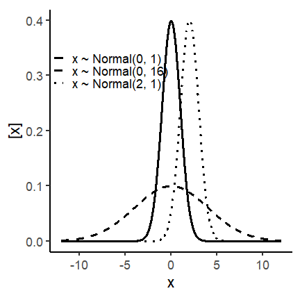
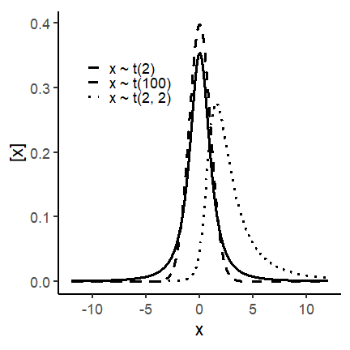
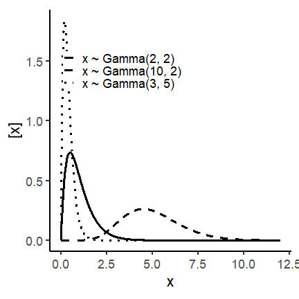
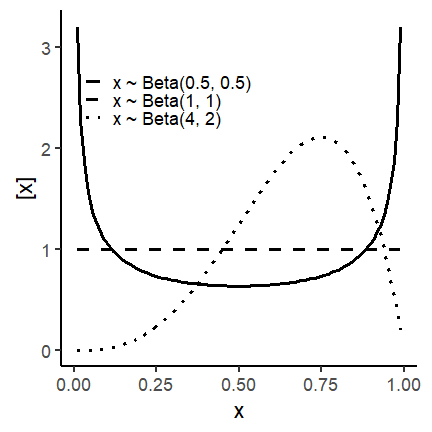
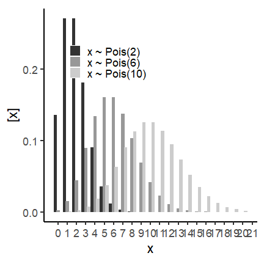

## Outline for today

-   **Distributions beyond the normal**  
-   **Defining your generalized linear model** 
-   **Applied examples**  
-   **Workshop wrap-up**: why mixed models are more important than ever.   

------

## What are GLMMs

-   Generalized Linear Models are models in which we can assume different distributions for our data beyond the Normal distribution.

-   Similar to general linear models, GLMs can also have random effects, thus, Generalized Linear Mixed Models - GLMMs.

### The structure of a GLMM

Remember that for a **LMMs**, assuming $\mathbf{y}$ arises from a normal distribution, we have:

$$
\mathbf{y} ={X}\boldsymbol{\beta} + Zu + \boldsymbol{\varepsilon} \\ \mathbf{\begin{bmatrix} \mathbf{u} \\ \boldsymbol{\varepsilon} \end{bmatrix} \sim \begin{pmatrix}  \begin{bmatrix} 0 \\ 0 \end{bmatrix}, \begin{bmatrix} \mathbf{G} \; 0 \\ 0 \; \mathbf{R} \end{bmatrix} \end{pmatrix}}
$$

In which:

-   $\mathbf{X}\boldsymbol{\beta}$ represents our fixed part of the equation, where $\mathbf{X}$ is a matrix informing the levels of our treatments and $\boldsymbol{\beta}$ a vector containing the fixed-effects parameters.

-   $\mathbf{Zu}$ represents our random part, where $\mathbf{Z}$ is a matrix informing the levels of the random effects and $\mathbf{u}$ is the vector containing the random effects parameters.

-   $\boldsymbol{\varepsilon}$ is the vector containing the residuals.

-   From $\mathbf{Zu} + \boldsymbol{\varepsilon}$ we have: $\mathbf{G}$ is the variance-covariance matrix of the random effects, and $\mathbf{R}$ is the variance-covariance matrix of the residuals.

    -   $\mathbf{G} = \boldsymbol{\sigma^2_u}\mathbf{I}$ and $\mathbf{R} = \boldsymbol{\sigma^2}\mathbf{I}$, in which $\mathbf{I}$ is the identity matrix.

Which is similar to:

$$
\mathbf{u} \sim N(0, \mathbf{I}\sigma^2_u) \\
\boldsymbol{\varepsilon} \sim N(0, \mathbf{I}\sigma^2)
$$

In this case:

$$
E(\mathbf{y}) = \mathbf{X}\boldsymbol{\beta}, \\
Var(\mathbf{y}) = \mathbf{ZGZ' + R}
$$

We can also write this model as:

$$
\mathbf{y} \sim N(\mathbf{X}\boldsymbol{\beta}, \; \mathbf{ZGZ' + R})
$$

or:

$$
\mathbf{y} \sim N(\mathbf{X}\boldsymbol{\beta}, \; \boldsymbol{\Sigma}) \\
\boldsymbol{\Sigma} = \mathbf{ZGZ' + R}
$$

For **GLMMs** the structure changes based on the distribution we will assume for $\mathbf{y}$, but is very similar to the last notation presented. A generic definition would be:

$$
\mathbf{y|u} \sim P(\mu, \; \phi)
$$

In which:

-   Linear predictor: $g(\mu) = \eta = \mathbf{X}\boldsymbol{\beta} + Zu$

    -   $g(\mu) = \eta$ is the link function applied to the expected value.

    -   $E(\mathbf{y|u}) = \mu$.

### Components of GLMMs

#### Link Functions

Our linear predictor $\mathbf{X}\boldsymbol{\beta}$ can produce all possible values in the y-axis of a plot, from $- \; \infty$ to $+ \; \infty$ depending on the value of the predictor variable. A link function links the linear predictor and the distribution assumed for the data $\mathbf{y}$.

In the **link scale**, the mean of $\mathbf{y}$ respect linearity of the linear predictor. In the **response scale**, the mean $\mu$ is back transformed by the inverse link and respects the support of the distribution.

The link function is applied to the expected value ($E(\mathbf{y})$), and not to the observations. Transformation of the observations also effect the error, while link functions only affect the parameters controlling the expected value.

Example of link functions:

+-------------------+-----------------------------------+--------------------------------+---------------------------------------------------------------------------------------------------------+
| Link Function     | Equation                          | Use                            | Why                                                                                                     |
+:=================:+:=================================:+:==============================:+:=======================================================================================================:+
| **Identity Link** | $g(\mu) = \mu$                    | Normal dist.                   | $E(\mathbf{y})$ can take any real value ($-\infty, \; +\infty$)                                         |
+-------------------+-----------------------------------+--------------------------------+---------------------------------------------------------------------------------------------------------+
| **Logit Link**    | $g(\mu) = log(\frac{\mu}{1-\mu})$ | Logistic, Beta, Binomial dist. | $E(\mathbf{y})$ can take any values between 0 and 1. Maps $(0, \; 1) \rightarrow (-\infty, \; +\infty)$ |
+-------------------+-----------------------------------+--------------------------------+---------------------------------------------------------------------------------------------------------+
| **Log Link**      | $g(\mu) = log(\mu)$               | Poisson, Gamma dist.           | $E(\mathbf{y})$ can take any positive values ($\mu > 0$)                                                |
|                   |                                   |                                |                                                                                                         |
|                   |                                   |                                | Multiplicative effects                                                                                  |
+-------------------+-----------------------------------+--------------------------------+---------------------------------------------------------------------------------------------------------+

#### Distributional assumption for the data

GLMMs support different distributions from the exponential family. Distributions from the exponential family share common structure, but are relatively different among themselves.

-   **What is an assumption?**: Something you take as true about your data or about the process that generated it!

Important distributions to know are:

-   **For continuous data**: Normal, t, Gamma, Beta.

-   **For discrete data**: Binomial, Poisson, Negative Binomial.

<body>

<table>
    <tr>
        <td><strong>Normal distribution</strong>  
        $$y \sim N(\mu, \sigma^2)$$
        $$E(y) = \mu$$
        $$Var(y) = \sigma^2$$
        Support (i.e., possible values for y):
        $$y \in (-\infty, +\infty)$$</td>
        <td></td>
    </tr>
    <tr>
        <td><strong>Student t  distribution</strong>  
        $$y \sim t_{\nu}(\mu, \sigma^2)$$
        $$E(y) = \mu \text{ for } \nu>1 \text{, otherwise undefined}$$
        $$Var(y) = \frac{\nu}{\nu-2}\sigma^2 \text{ for }
        \\ \nu>2 \text{, otherwise undefined}$$
        Support (i.e., possible values for y):
        $$y \in (-\infty, +\infty)$$
        </td>
        <td></td>
    </tr>
    <tr>
        <td><strong>Gamma distribution</strong>  
        $$y \sim Gamma(\alpha, \beta)$$
        $$E(y) = \frac{\alpha}{\beta}$$
        $$Var(y) = \frac{\alpha}{\beta^2}$$
        Support (i.e., possible values for y):
        $$y \in (0, +\infty)$$</td>
        <td></td>
    </tr>
    <tr>
        <td><strong>Beta distribution</strong>  
        $$y \sim Beta(\alpha, \beta)$$
        $$E(y) = \frac{\alpha}{\alpha+\beta}$$
        $$Var(y) = \frac{\alpha \beta }{(\alpha+\beta)^2(\alpha+\beta+1)}$$
        Support (i.e., possible values for y):
        $$y \in (0, 1)$$</td>
        <td></td>
    </tr>
    <tr>
        <td><strong>Poisson distribution</strong>  
        $$y \sim Pois(\lambda)$$
        $$E(y) = \lambda$$
        $$Var(y) = \lambda$$
        Support (i.e., possible values for y):
        $$y \in (0, 1, 2, ..., +\infty)$$</td>
        <td></td>
    </tr>
</table>
</body>

------

## Defining the statistical model -- a step-by-step approach  

1. Identify the probability distribution of $$y$$.  
2. State the linear predictor $$\eta$$ (random effects just like we did 
for normally distributed data).   
3. Identify a link function that connects $$E(y)$$ to $$\eta$$.   

### Example I: 

The data were generated by a designed experiment studying the effect of 
different herbicide treatments on grain yield in an RCBD with 3 repetitions. 

**1. Identify the probability distribution of $$y$$.**  

Usually we can safely assume $$y_{ij} \sim N(\mu_{ij}, \sigma^2)$$.

**2. State the linear predictor $$\eta$$ (random effects just like we did for normally distributed data).**

Just like we were doing before:

$$\eta_{ij} = \eta_0 + \tau_i + u_{j},$$

where $$\eta_{ij}$$ is the linear predictor, 
$$\eta_0$$ is the overall mean for the linear predictor, 
$$\tau_i$$ is the (fixed) effect of the $$i$$th treatment on the linear predictor, 
and $$u_{j}$$ is the (fixed/random) effect of the $$j$$th block on the linear predictor.

**3. Identify a link function that connects $$E(y)$$ to $$\eta$$.**   

Because we assume a normal distribution for the data, where one of the parameters (i.e., $$\mu$$)
is actually the mean, we can use the identity link function = 

$$\mu = \eta.$$

### Example II: 

The data were generated by a designed experiment studying the effect of 
different herbicide treatments on weed damage (in %) in an RCBD with 3 repetitions. 

**1. Identify the probability distribution of $$y$$.**  

Because we are dealing with a proportion, we could assume 
$$y_{ij} \sim Beta(\mu_{ij}, \psi_{ij})$$.

**2. State the linear predictor $$\eta$$ (random effects just like we did for normally distributed data).**

Just like we were doing before:

$$\eta_{ij} = \eta_0 + \tau_i + u_{j},$$

where $$\eta_{ij}$$ is the linear predictor, 
$$\eta_0$$ is the overall mean for the linear predictor, 
$$\tau_i$$ is the (fixed) effect of the $$i$$th treatment on the linear predictor, 
and $$u_{j}$$ is the (fixed/random) effect of the $$j$$th block on the linear predictor.

**3. Identify a link function that connects $$E(y)$$ to $$\eta$$.**   

Because we assume a normal distribution for the data, where one of the parameters (i.e., $$\mu$$)
is actually the mean, we can use the identity link function = 

$$\text{logit}(\mu) = \eta.$$

### Log-transformations  

- Changes in the structure of the residuals: from normal to log-normal.  
- What is the target variable we aim to study?  
- *If the data are not Gaussian, we must make them “act Gaussian”, essentially amounts to the modeling version of the “when you have a hammer, try to make every problem look like a nail”* [(Stroup et al., 2024)](https://www.routledge.com/Generalized-Linear-Mixed-Models-Modern-Concepts-Methods-and-Applications/Stroup-Ptukhina-Garai/p/book/9781498755566?srsltid=AfmBOop80SBSwTFMCIzkiTtYe-5uir_Xnw2KVZxa1oXb4LJWrLRx0Wwq)
- No one-size-fits-all recommendation.   

------

## Applied examples

## Applied example I - counts  

The following data come from an experiment designed to study 
the effect of different treatments on the population of webworms 
[(Beall, 1940)](https://doi.org/10.2307/1930285). 
The experiment was an RCBD with 4 treatments and 13 repetitions.  

<html lang="en">
<head>
    <meta charset="UTF-8">
    <meta name="viewport" content="width=device-width, initial-scale=1.0">
    <title></title>
    
</head>
<body>
    <pre>
<code>
library(tidyverse)
library(glmmTMB)
library(DHARMa)
library(agridat)
</code>
    </pre>
</body>
</html>


dat <- beall.webworms

m1 <- glmmTMB(y ~ trt + (1|block),
              family = poisson(link = "log"),
              data  = dat)

res1 <- simulateResiduals(m1, plot = T)


{% include figure.html img="day3/DHARMa_example1a.png" alt="" caption="" width="80%" %}


m2 <- glmmTMB(y ~ trt + (1|block),
              family = nbinom1(link = "log"),
              data  = dat)

res2 <- simulateResiduals(m2, plot = T)
summary(m2)


{% include figure.html img="day3/DHARMa_example1b.png" alt="" caption="" width="80%" %}


##  Family: nbinom1  ( log )
## Formula:          y ~ trt + (1 | block)
## Data: dat
## 
##      AIC      BIC   logLik deviance df.resid 
##   3012.4   3043.4  -1500.2   3000.4     1294 
## 
## Random effects:
## 
## Conditional model:
##  Groups Name        Variance Std.Dev.
##  block  (Intercept) 0.1034   0.3216  
## Number of obs: 1300, groups:  block, 13
## 
## Dispersion parameter for nbinom1 family (): 0.308 
## 
## Conditional model:
##             Estimate Std. Error z value Pr(>|z|)    
## (Intercept)  0.27106    0.10482   2.586  0.00971 ** 
## trtT2       -0.97814    0.10155  -9.632  < 2e-16 ***
## trtT3       -0.47650    0.08642  -5.514 3.51e-08 ***
## trtT4       -1.20051    0.11028 -10.886  < 2e-16 ***
## ---
## Signif. codes:  0 '***' 0.001 '**' 0.01 '*' 0.05 '.' 0.1 ' ' 1


## Applied example II - successes  

The following data arise from an experiment studying germination of 
Orobanche seeds [(Crowder, 1978)](https://www.jstor.org/stable/2346223?origin=crossref&seq=1).  
The data indicate the total number of seeds (`n`) and the number of germinated seeds (`germ`). 


dat <- crowder.seeds

m1 <- glmmTMB(cbind(germ, n-germ) ~ extract*gen,
              family = binomial(link = "logit"),
              data = dat)

res1 <- simulateResiduals(m1, plot = T)


{% include figure.html img="day3/DHARMa_binomial.png" alt="" caption="" width="80%" %}


summary(m1)



##  Family: binomial  ( logit )
## Formula:          cbind(germ, n - germ) ~ extract * gen
## Data: dat
## 
##      AIC      BIC   logLik deviance df.resid 
##    117.9    122.1    -54.9    109.9       17 
## 
## 
## Conditional model:
##                        Estimate Std. Error z value Pr(>|z|)  
## (Intercept)             -0.4122     0.1842  -2.238   0.0252 *
## extractcucumber          0.5401     0.2498   2.162   0.0306 *
## genO75                  -0.1459     0.2232  -0.654   0.5132  
## extractcucumber:genO75   0.7781     0.3064   2.539   0.0111 *
## ---
## Signif. codes:  0 '***' 0.001 '**' 0.01 '*' 0.05 '.' 0.1 ' ' 1


## Wrap-up - Why hierarchical models are more important than ever  

### Why are mixed models sometimes called 'hierarchical' or 'multilevel' models?  

{% include figure.html img="day3/hierarchical_ag.jpg" alt="" caption="" width="80%" %}


{% include figure.html img="day3/hierarchical_swine.jpg" alt="" caption="Schematic diagram of a Hierarchical Model with repeated measures and subsampling. The variance components portrayed here correspond to a designed experiment disposed in a randomized complete block design (i.e., room as blocking factor, $$\sigma^2_u$$ or $$\sigma^2_{rooms}$$). Pens are the experimental units but there is subsampling (thus adding the variance component $$\sigma^2_v$$ or $$\sigma^2_{pens}$$): pig is the observational unit, and there are 3 pigs per pen being observed. In addition, each pig is observed at several points in time, thus adding the variance component $$\sigma^2_w$$ (or $$\sigma^2_{pigs}$$). Last, $$\sigma^2_e$$ is the residual variance." width="100%" %}



### Major benefits we get from mixed models   

- Information is **shared** across groups  
- More robust under unbalanced scenarios  
- Very helpful to handle missing data  
- No need to average across observations - information is preserved!  

>I want to convince the reader of something that appears unreasonable: 
*multilevel regression deserves to be the default form of regression.* 
Papers that do not use multilevel models should have to justify 
not using a multilevel approach. Certainly some data and contexts do
not need the multilevel treatment. But most contemporary studies in the social and natural
sciences, whether experimental or not, would benefit from it. Perhaps the most important
reason is that even well-controlled treatments interact with unmeasured aspects 
of the individuals, groups, or populations studied. 
This leads to variation in treatment effects, in which individuals or groups vary
in how they respond to the same circumstance. Multilevel models attempt to quantify
the extent of this variation, as well as identify which units in the data
responded in which ways.  
>
--[Statistical Rethinking, Richard McElreath](https://civil.colorado.edu/~balajir/CVEN6833/bayes-resources/RM-StatRethink-Bayes.pdf).

[[Also see McEreath's blog post](https://elevanth.org/blog/2017/08/24/multilevel-regression-as-default/)]

------

## What's next  

- I'll be teaching STAT 720 this summer and STAT 870 this fall. 
- Feel free to reach out with questions/concerns/more advanced questions.  
- Please answer this [survey](https://forms.gle/Tm9rnzgSVDcVLAik7) to help me improve future editions of the same workshop/create a follow-up based on demand. 

